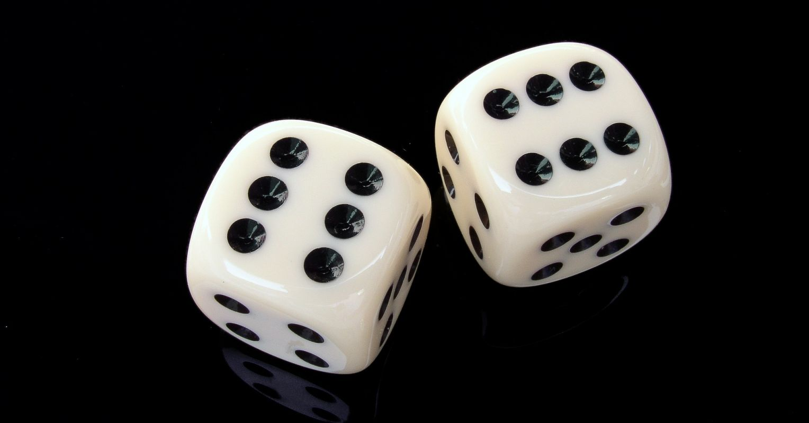
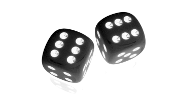
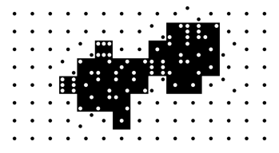
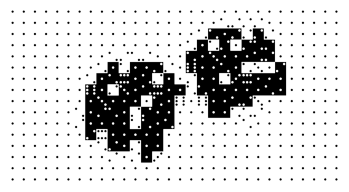
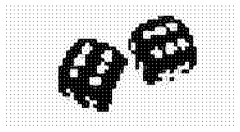
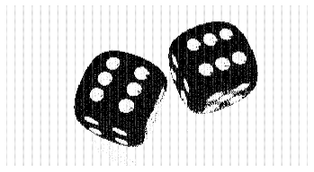
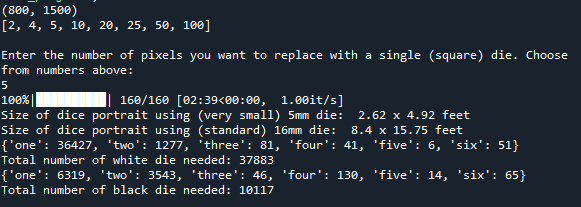

# dicemap
Ever seen those cool projects where artists will recreate portraits with dice?
Use this tool to help plan what it will look like and how many dice you need.
## Example
<h3 align="center">
  
 
    Original
   

  
</h3>

<h3 align="center">
  
 
    Grayscale
   

  
</h3>

<h3 align="center">
  
 
    1 die for every 100x100 pixels
   

  
</h3>

<h3 align="center">
  
 
    1 die for every 50x50 pixels
   

  
</h3>

<h3 align="center">
  
 
    1 die for every 25x25 pixels
   

  
</h3>

<h3 align="center">
  
 
    1 die for every 5x5 pixels
   

  
</h3>

<h3 align="center">
  
 
    Project info output for the above "1 die for every 5x5 pixels"
   

  
</h3>
